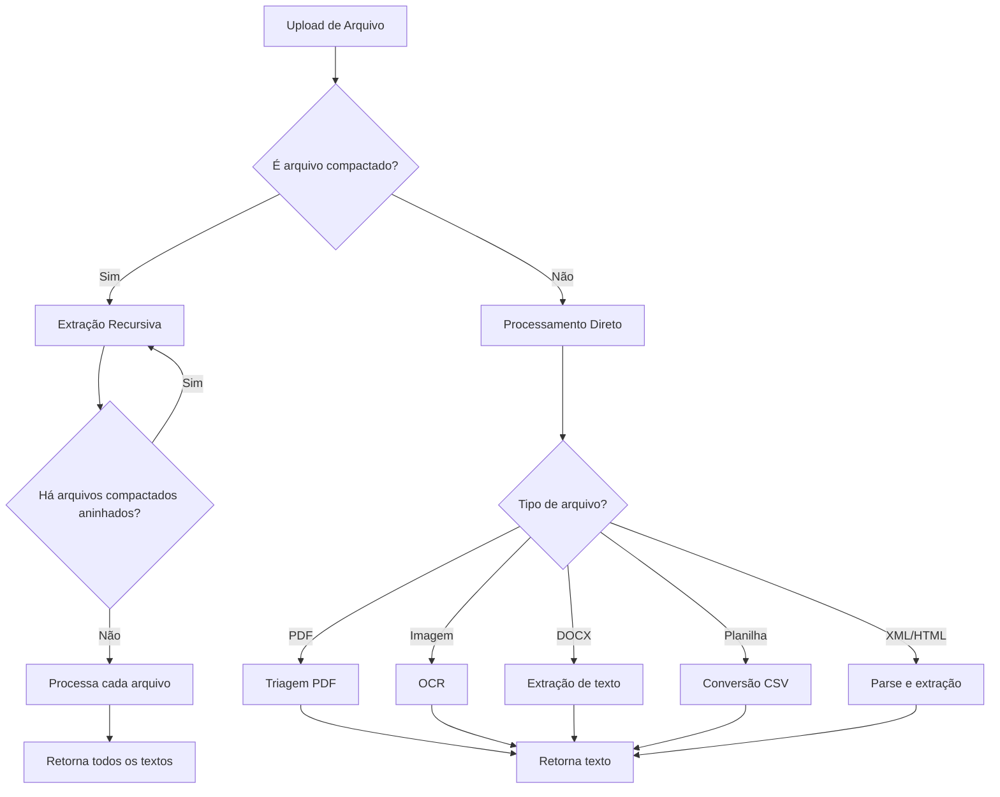

# OCR Supreme - Hub de Processamento de Documentos


API de processamento inteligente de documentos com suporte a múltiplos formatos e extração recursiva de arquivos compactados.

## 🚀 Funcionalidades

- ✅ **Processamento de PDFs** com triagem inteligente (texto nativo vs. OCR necessário)
- ✅ **OCR Forçado** - Novo endpoint que sempre tenta OCR, mesmo em documentos com imagens
- ✅ **OCR de Imagens** com suporte a TIFF multi-página
- ✅ **Extração de Texto** de DOCX, XML, HTML
- ✅ **Conversão de Planilhas** (XLS, XLSX) para CSV
- ✅ **Arquivos Compactados** (.zip, .rar) com extração **recursiva**
- ✅ **Detecção Automática** de arquivos compactados aninhados
- ✅ **API Key Authentication** para segurança
- ✅ **Health Check** endpoint
- ✅ **Docker & Docker Compose** para deploy fácil

## 📋 Formatos Suportados

### Documentos

- **PDF** (.pdf) - com triagem automática para otimizar processamento
- **Word** (.docx)
- **Texto** (.txt, .csv)

### Planilhas

- **Excel** (.xlsx, .xls)

### Imagens

- **Imagens comuns** (.jpg, .png, .gif, .bmp)
- **TIFF** (.tiff, .tif) - suporte a múltiplas páginas

### Markup

- **XML** (.xml)
- **HTML** (.html, .htm)

### Arquivos Compactados (com suporte recursivo!)

- **ZIP** (.zip)
- **RAR** (.rar)

## 🔧 Instalação

### Usando Docker (Recomendado)

1. Clone o repositório:

```bash
git clone https://github.com/Folkz1/ocr_supreme.git
cd ocr_supreme
```

2. Configure as variáveis de ambiente:

```bash
cp .env.example .env
# Edite o arquivo .env com suas configurações
```

3. Inicie com Docker Compose:

```bash
docker-compose up -d
```

A API estará disponível em `http://localhost:8000`

### Instalação Manual

1. Clone o repositório:

```bash
git clone https://github.com/Folkz1/ocr_supreme.git
cd ocr_supreme
```

2. Instale as dependências do sistema:

```bash
# Ubuntu/Debian
sudo apt-get update
sudo apt-get install -y libmagic1 tesseract-ocr tesseract-ocr-por tesseract-ocr-eng unrar

# macOS
brew install libmagic tesseract tesseract-lang unrar
```

3. Instale as dependências Python:

```bash
pip install -r requirements.txt
```

4. Configure as variáveis de ambiente:

```bash
export API_KEY="sua-chave-super-secreta"
export OCR_LANG="por+eng"
```

5. Execute a aplicação:

```bash
uvicorn main:app --host 0.0.0.0 --port 8000
```

## 🔐 Configuração

### Variáveis de Ambiente

| Variável                  | Descrição                                | Padrão          |
| ------------------------- | ---------------------------------------- | --------------- |
| `API_KEY`                 | Chave de API para autenticação           | _(obrigatório)_ |
| `API_KEY_HEADER_NAME`     | Nome do header da API key                | `X-API-Key`     |
| `PORT`                    | Porta do servidor                        | `8000`          |
| `PAGE_TEXT_THRESHOLD`     | Limite de caracteres para triagem de PDF | `50`            |
| `OCR_PAGE_CHAR_THRESHOLD` | Limite de caracteres para OCR            | `15`            |
| `RENDER_SCALE`            | Escala de renderização para OCR          | `2.0`           |
| `OCR_LANG`                | Idiomas do Tesseract                     | `por+eng`       |
| `OCR_MAX_PAGES_TO_CHECK`  | Máx. páginas para verificar OCR          | `10`            |
| `MAX_IMAGE_FRAMES`        | Máx. frames para TIFF multipágina        | `5`             |
| `MAX_RECURSION_DEPTH`     | Máx. profundidade de extração recursiva  | `10`            |

## 📡 Endpoints da API

### `POST /process-file/`

Processa um arquivo individual (qualquer formato suportado) com triagem inteligente.

**Request:**

```bash
curl -X POST "http://localhost:8000/process-file/" \
  -H "X-API-Key: sua-chave-aqui" \
  -F "file=@documento.pdf"
```

**Response:**

```json
{
  "filename": "documento.pdf",
  "status": "processed",
  "message": "PDF processado com sucesso.",
  "data": {
    "content_type": "text/plain",
    "content": "Texto extraído do documento..."
  }
}
```

### `POST /onlyocr/` ⭐ NOVO!

Processa um arquivo **sempre tentando OCR**, mesmo em documentos com imagens. Só escala para processamento externo se o OCR falhar completamente.

**Diferença do `/process-file/`:**

- `/process-file/`: Detecta imagens e pode retornar `requires_ocr` sem tentar OCR
- `/onlyocr/`: **SEMPRE** tenta fazer OCR localmente, independente de ter imagens

**Request:**

```bash
curl -X POST "http://localhost:8000/onlyocr/" \
  -H "X-API-Key: sua-chave-aqui" \
  -F "file=@documento.pdf"
```

**Response (sucesso):**

```json
{
  "filename": "documento.pdf",
  "status": "processed",
  "message": "PDF processado com sucesso usando OCR.",
  "data": {
    "content_type": "text/plain",
    "content": "Texto extraído via OCR..."
  }
}
```

**Response (falha no OCR):**

```json
{
  "filename": "documento.pdf",
  "status": "requires_external_ocr",
  "message": "OCR local falhou. Necessário processamento externo (Textract).",
  "data": {}
}
```

### `POST /process-archive/`

Processa arquivos compactados (.zip, .rar) de forma **recursiva**.

**Request:**

```bash
curl -X POST "http://localhost:8000/process-archive/" \
  -H "X-API-Key: sua-chave-aqui" \
  -F "file=@documentos.rar"
```

**Response:**

```json
{
  "filename": "documentos.rar",
  "archive_type": "rar",
  "status": "processed",
  "message": "Arquivo compactado processado com sucesso. 15/20 arquivos processados.",
  "total_files": 20,
  "processed_files": 15,
  "files": [
    {
      "filename": "contrato.pdf",
      "path_in_archive": "documentos/2024/contrato.pdf",
      "size": 102400,
      "extracted_text": "Texto do contrato...",
      "status": "processed",
      "error": null
    },
    {
      "filename": "relatorio.docx",
      "path_in_archive": "nested.zip/relatorio.docx",
      "size": 51200,
      "extracted_text": "Texto do relatório...",
      "status": "processed",
      "error": null
    }
  ]
}
```

### `GET /health`

Verifica o status do serviço.

**Response:**

```json
{
  "status": "healthy",
  "version": "3.0.0"
}
```

## 🎯 Casos de Uso

### 1. Processar um PDF simples

```bash
curl -X POST "http://localhost:8000/process-file/" \
  -H "X-API-Key: sua-chave" \
  -F "file=@documento.pdf"
```

### 2. Processar um arquivo RAR com documentos aninhados

```bash
curl -X POST "http://localhost:8000/process-file/" \
  -H "X-API-Key: sua-chave" \
  -F "file=@documentos.rar"
```

O sistema automaticamente:

- Detecta que é um arquivo .rar
- Extrai todos os arquivos
- Se encontrar .zip ou .rar dentro, extrai recursivamente
- Processa cada documento encontrado
- Retorna o texto extraído de todos os arquivos

### 3. Processar uma imagem com OCR

```bash
curl -X POST "http://localhost:8000/process-file/" \
  -H "X-API-Key: sua-chave" \
  -F "file=@documento-escaneado.jpg"
```

## 🏗️ Arquitetura

```
ocr_supreme/
├── main.py              # Código principal da API
├── Dockerfile           # Container Docker
├── docker-compose.yml   # Orquestração Docker
├── requirements.txt     # Dependências Python
├── .env.example         # Exemplo de variáveis de ambiente
├── .gitignore          # Arquivos ignorados pelo Git
└── README.md           # Este arquivo
```

## 🔄 Fluxo de Processamento



## 🚀 Deploy no Easypanel

1. Faça push para o GitHub:

```bash
git remote add origin https://github.com/Folkz1/ocr_supreme.git
git push -u origin main
```

2. No Easypanel:
   - Crie um novo serviço
   - Selecione "Deploy from GitHub"
   - Escolha o repositório `ocr_supreme`
   - Configure as variáveis de ambiente (API_KEY, etc.)
   - Easypanel detectará automaticamente o Dockerfile

3. Configure o domínio:
   - Use o domínio padrão ou configure um personalizado
   - Exemplo: `https://n8n-ocr-service.jz9bd8.easypanel.host`

## 📊 Status Codes

| Status                      | Descrição                                                                  |
| --------------------------- | -------------------------------------------------------------------------- |
| `processed`                 | Arquivo processado com sucesso                                             |
| `requires_ocr`              | Arquivo precisa de OCR robusto (AWS Textract) - usado por `/process-file/` |
| `requires_external_ocr`     | OCR local falhou, necessário processamento externo - usado por `/onlyocr/` |
| `single_page_pdf`           | PDF de página única detectado                                              |
| `multipage_pdf_with_images` | PDF multipáginas com imagens                                               |
| `multipage_pdf_text_only`   | PDF multipáginas só com texto                                              |
| `error`                     | Erro no processamento                                                      |
| `unsupported`               | Formato não suportado                                                      |

## 🛠️ Desenvolvimento

### Executar em modo de desenvolvimento

```bash
uvicorn main:app --reload --host 0.0.0.0 --port 8000
```

### Executar testes

```bash
# Em breve: pytest
```

### Build da imagem Docker

```bash
docker build -t ocr-supreme:latest .
```

## 🤝 Contribuindo

Contribuições são bem-vindas! Por favor:

1. Faça um Fork do projeto
2. Crie uma branch para sua feature (`git checkout -b feature/AmazingFeature`)
3. Commit suas mudanças (`git commit -m 'Add some AmazingFeature'`)
4. Push para a branch (`git push origin feature/AmazingFeature`)
5. Abra um Pull Request

## 📝 Licença

Este projeto está sob a licença MIT. Veja o arquivo `LICENSE` para mais detalhes.

## 👤 Autor

**Folkz1**

- GitHub: [@Folkz1](https://github.com/Folkz1)
- Projeto: [ocr_supreme](https://github.com/Folkz1/ocr_supreme)

## 🙏 Agradecimentos

- [FastAPI](https://fastapi.tiangolo.com/) - Framework web moderno
- [Tesseract OCR](https://github.com/tesseract-ocr/tesseract) - Motor de OCR
- [PyMuPDF](https://pymupdf.readthedocs.io/) - Processamento de PDFs
- [rarfile](https://github.com/markokr/rarfile) - Suporte a arquivos RAR

---

**⭐ Se este projeto foi útil, considere dar uma estrela no GitHub!**
